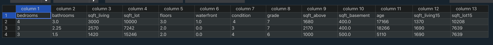

# Assignment-CSE-30124-RE-ApprAIse
ApprAIse as an AI model made for buyers and sellers to calculate the price/cost of housing. 

# Progress Report 3

## NEW Python Notebook

I added a python notebook that can be found [here](https://github.com/NeolGG/CSE-30124-RE-ApprAIse/blob/main/CSE_30124_RE_ApprAIse.ipynb)

It uses the [USA Real Estate Dataset](https://www.kaggle.com/datasets/ahmedshahriarsakib/usa-real-estate-dataset) instead of the Kc_county dataset. The python notebook estimates a price based on housing data per STATE.

# Progress Report 2

## Getting Started

Things you need to get setup

### Prerequisites

To install all the required packages, use the requirements.txt file provided

    pip install -r requirements.txt

## Usage

### housing_model.py 

This creates a model based on the data from a csv file. Usage:

    ./housing_model.py input_file.csv

The model uses a linear regression for proof of concept and assumes the user is browsing the market on January 1, 2016

The model presented uses a 2014-2015 King-County Housing Dataset as the 'input_file.csv' with the following labels:

- price:            Price asked
- bedrooms:         # of bedrooms
- bathrooms:        # of bathrooms
- sqft_living:      squarefootage of the home
- sqft_lot:         squarefootage of the lot
- floors:           total floors (levels) in house
- waterfront:       whether it has a view to a waterfront (0 or 1)
- condition:        how good the condition is ( Overall ) (1-5)
- grade:            overall grade given to the housing unit, based on King County grading system (1-13)
- sqft_above:       square footage of house apart from basement 
- sqft_basement:    square footage of the basement
- age:              amount of days passed since built to 1/1/2016
- sqft_living15:    the square footage of interior housing living space for the nearest 15 neighbors
- sqft_lot15:       the square footage of the land lots of the nearest 15 neighbors

Heres the link to the Kaggle Data:

https://www.kaggle.com/datasets/doesnotcompile/nf-kc-house-data

### predict.py

This predicts the value of a house given it's property details in the form of a csv file. Usage:

    ./predict.py input_file.csv

The 'input_file.csv' should have the data formatted with columns like this:

    bedrooms,bathrooms,sqft_living,sqft_lot,floors,waterfront,condition,grade,sqft_above,sqft_basement,age,sqft_living15,sqft_lot15

'csvs/exampleData.csv' is a good example of how data should be formatted with the columns, look at it to see example houses.

[]